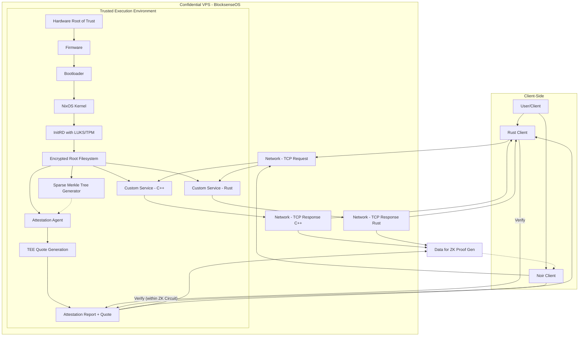

# BlocksenseOS Design Document

**Version:** 0.1.0
**Date:** 2025-05-19

**Table of Contents:**

1.  [Introduction](#introduction)
2.  [Goals](#goals)
3.  [Core Principles](#core-principles)
4.  [System Architecture Overview](#system-architecture-overview)
5.  [NixOS Foundation](#nixos-foundation)
    * [5.1. Reproducible Builds](#51-reproducible-builds)
    * [5.2. Nix Flake](#52-nix-flake)
    * [5.3. Custom Build Process](#53-custom-build-process)
6.  [Confidential Computing and Remote Attestation](#confidential-computing-and-remote-attestation)
    * [6.1. Trusted Execution Environments (TEEs)](#61-trusted-execution-environments-tees)
    * [6.2. Remote Attestation Flow](#62-remote-attestation-flow)
    * [6.3. Attestation Report Contents](#63-attestation-report-contents)
    * [6.4. Mapping Firmware Authenticity to OS Image Authenticity](#64-mapping-firmware-authenticity-to-os-image-authenticity)
7.  [Custom Services](#custom-services)
    * [7.1. C++ Echo Service](#71-c-echo-service)
    * [7.2. Rust Echo Service](#72-rust-echo-service)
    * [7.3. Service Integration via NixOS Modules](#73-service-integration-via-nixos-modules)
8.  [Sparse Merkle Tree for Derivation Hashing](#sparse-merkle-tree-for-derivation-hashing)
    * [8.1. Purpose](#81-purpose)
    * [8.2. Implementation](#82-implementation)
    * [8.3. Integration with Attestation](#83-integration-with-attestation)
9.  [Hardware Considerations](#hardware-considerations)
    * [9.1. CPU Support (Intel TDX, AMD SEV-SNP)](#91-cpu-support-intel-tdx-amd-sev-snp)
    * [9.2. GPU Support (NVIDIA Hopper Confidential Computing)](#92-gpu-support-nvidia-hopper-confidential-computing)
    * [9.3. CPU-GPU Data Transfer under Encryption](#93-cpu-gpu-data-transfer-under-encryption)
10. [Disk Encryption](#disk-encryption)
    * [10.1. TPM-based Key Storage](#101-tpm-based-key-storage)
    * [10.2. Protection Against Data Center Access](#102-protection-against-data-center-access)
    * [10.3. Custom Firmware and vTPM](#103-custom-firmware-and-vtpm)
11. [Deployment Targets](#deployment-targets)
    * [11.1. On-Premise (Dedicated Hardware)](#111-on-premise-dedicated-hardware)
    * [11.2. Public Clouds (Azure, AWS, GCP)](#112-public-clouds-azure-aws-gcp)
12. [Development and Testing Environment](#development-and-testing-environment)
    * [12.1. Primary Environment (Linux/NixOS)](#121-primary-environment-linuxnixos)
    * [12.2. macOS Adaptation](#122-macos-adaptation)
    * [12.3. Local VM Testing](#123-local-vm-testing)
13. [Client-Side Verification](#client-side-verification)
    * [13.1. Rust Client](#131-rust-client)
    * [13.2. Noir Client (Zero-Knowledge Proofs)](#132-noir-client-zero-knowledge-proofs)
14. [Security Considerations](#security-considerations)
15. [Future Work](#future-work)

---

## 1. Introduction

BlocksenseOS is a custom NixOS-based operating system designed to run within Trusted Execution Environments (TEEs) on Confidential Virtual Private Servers (VPS). Its primary purpose is to provide a verifiable and secure environment for running sensitive workloads. Users can remotely attest to the integrity of the BlocksenseOS image and the underlying hardware, ensuring that their applications are running as intended in a confidential context.

This document outlines the design considerations and architecture of BlocksenseOS.

## 2. Goals

* **Verifiability:** Enable remote attestation of the entire software stack, from firmware up to the running applications.
* **Reproducibility:** Ensure that the BlocksenseOS image can be built reproducibly, allowing anyone to verify its contents and hash.
* **Confidentiality:** Leverage TEE capabilities to protect data in use, both in CPU and GPU memory.
* **Security:** Implement robust security measures, including full disk encryption with keys protected by a TPM.
* **Portability:** Support deployment on-premise and across major public cloud providers (Azure, AWS, GCP).
* **Extensibility:** Allow for the easy addition and verification of custom services running within the OS.
* **Zero-Knowledge Proof Integration:** Provide a mechanism (via a Noir client) to prove claims about the execution of services within BlocksenseOS without revealing unnecessary details.

## 3. Core Principles

* **Trust Minimization:** Rely on the hardware TEE as the root of trust and minimize trust in the infrastructure provider.
* **Transparency:** Make the build process and system configuration auditable and reproducible.
* **Security by Design:** Integrate security considerations at every stage of the design and development process.
* **Modularity:** Design components (NixOS modules, services) to be independent and easily manageable.

## 4. System Architecture Overview

BlocksenseOS will consist of the following key components:

1.  **Reproducible NixOS Base Image:** A minimal, custom NixOS image built using Nix flakes.
2.  **Custom NixOS Modules:** Modules for integrating and managing custom services and system configurations.
3.  **Attestation Agent:** A program running within BlocksenseOS responsible for collecting system information (e.g., image hash, derivation hashes) to be included in the remote attestation report.
4.  **Custom Services:** Example C++ (CMake-based) and Rust (Cargo-based) echo services demonstrating workload execution.
5.  **Sparse Merkle Tree Generator:** A tool to compute the root hash of selected NixOS derivation hashes, to be included in the attestation.
6.  **Disk Encryption Setup:** Configuration for full disk encryption using LUKS, with the decryption key sealed to the TPM.

Clients (Rust and Noir) will interact with a BlocksenseOS instance as follows:

1.  The client initiates a connection to a service running on BlocksenseOS.
2.  The client requests a remote attestation quote from a service within the BlocksenseOS instance.
3.  The TEE on the server generates an attestation report, including:
    * Measurements of the firmware and bootloader.
    * A hash of the BlocksenseOS image.
    * The root hash of the sparse Merkle tree of custom derivation hashes.
    * Other platform-specific measurements.
4.  The attestation report is signed by a platform-specific key (e.g., Intel PCDK, AMD ASK).
5.  The client receives the attestation report and verifies it:
    * Checks the signature against the TEE vendor's public keys.
    * Compares the reported OS image hash with the hash of a locally reproduced BlocksenseOS build.
    * Verifies the hash of attesting service is included in the sparse Merkle tree of service within the BlocksenseOS instance.
6.  (For Noir client) The client uses the verified attestation data and the service interaction transcript to generate a ZK proof, demonstrating that a specific response was produced by an authenticated service running on a verified BlocksenseOS instance.



### 5. NixOS Foundation

#### 5.1. Reproducible Builds

NixOS is inherently designed for reproducible builds. This means that given the same Nix expressions (configuration files and package definitions), Nix will produce a bit-for-bit identical output. This is crucial for BlocksenseOS as it allows anyone to:

1.  Obtain the BlocksenseOS Nix configuration.
2.  Build the OS image locally.
3.  Calculate the cryptographic hash of the resulting image.
4.  Compare this hash with the one reported in the remote attestation from a running BlocksenseOS instance.

**Implementation Details:**

* All package inputs will be pinned to specific versions/hashes.
* The build environment will be strictly controlled by Nix.
* We will leverage Nix's content-addressed derivations to ensure that any change in inputs results in a different output hash.
* The final OS image (e.g., a raw disk image or a specific VM image format) will be the subject of the hash comparison. We will need a deterministic way to produce this final image from the Nix store paths. `nixos-generators` or custom scripting using `nix build` on a top-level image derivation will be used.

#### 5.2. Nix Flake

The entire BlocksenseOS project, including the OS image definition, custom packages, development environment, and testing tools, will be managed as a Nix flake.

**Benefits of using Flakes:**

* **Hermeticity and Reproducibility:** Flakes pin their inputs (other flakes, Nixpkgs versions), leading to more reliable reproducibility across different machines and times.
* **Standardized Structure:** Flakes provide a standard way to structure Nix projects, making them easier to understand and use.
* **Defined Outputs:** Flakes explicitly declare their outputs (packages, NixOS modules, apps, checks, etc.).

### 5.3. Custom Build Process

The `blocksenseOS-image` output in the flake will define how the final OS image is assembled. This will involve:

1.  Specifying a list of NixOS modules to include (base configuration, custom services, attestation agent configuration).
2.  Using a NixOS image generator (like `nixos-generators` or a custom one using `pkgs.runCommand` with `nix-build` and image creation tools like `qemu-img`).
3.  The output will be a disk image (e.g., `.raw`, `.qcow2`) whose hash is the target for attestation.

**Measuring the OS Image Hash:**
The hash included in the attestation report must correspond *exactly* to the output of a reproducible build of `packages.<system>.blocksenseOS-image`. This might be the hash of the NAR (Nix Archive) of the image path in the Nix store, or more practically, the hash of the generated disk image file itself. The latter requires the image generation process to be deterministic.

### 6. Confidential Computing and Remote Attestation

#### 6.1. Trusted Execution Environments (TEEs)

BlocksenseOS is designed to run within hardware-based TEEs. The primary TEE technologies targeted are:

* **Intel Trust Domain Extensions (TDX):** Provides CPU-isolated confidential VMs called Trust Domains (TDs). Attestation relies on the Intel TDX module and a quote generation process.
* **AMD Secure Encrypted Virtualization - Secure Nested Paging (SEV-SNP):** Offers memory encryption and integrity protection for VMs. Attestation involves the AMD Secure Processor.
* **NVIDIA Hopper Confidential Computing:** Extends confidentiality to GPU workloads, protecting data on the GPU and during transfer from CPU to GPU.

#### 6.2. Remote Attestation Flow

1.  **Client Request:** A client wishing to verify the BlocksenseOS instance requests an attestation quote.
2.  **TEE Quote Generation:**
    * The CPU's TEE (TDX or SEV-SNP) generates a hardware-signed quote. This quote contains measurements of the platform's state, including firmware, bootloader, and potentially a specific value (e.g., hash of the OS image or a public key) provided by the OS running inside the TEE (the "report data" or "user data" field in the quote).
    * For GPU workloads, NVIDIA's solution involves an attestation sequence that verifies the GPU's confidential state, potentially in conjunction with the CPU TEE's attestation.
3.  **Attestation Report Construction:**
    * Inside BlocksenseOS, an **Attestation Agent** service will be responsible for:
        * Obtaining the hash of the running BlocksenseOS image (this needs a reliable way to get the *exact* image hash that corresponds to the reproducible build). One common method is to bake this hash into the image itself during the build process (e.g., in a well-known file or kernel command line parameter) if the TEE measurement doesn't directly cover the entire OS image in a granular way.
        * Invoking the `derivation-hasher` tool to compute the sparse Merkle tree root of the specified NixOS derivation hashes (custom services, critical libraries).
        * Collecting any other relevant information.
        * Requesting the TEE to include this data (or a hash of it) in the "report data" field of the hardware quote.
4.  **Report Transmission:** The signed quote and the accompanying data (forming the complete attestation report) are sent to the client.
5.  **Client Verification:** The client performs the following checks:
    * **Quote Signature:** Verifies the TEE quote's signature using the TEE vendor's (Intel, AMD) public certificates/keys. This confirms the quote originated from genuine hardware.
    * **Platform Integrity:** Checks TCB (Trusted Computing Base) information in the quote (e.g., security patch levels of firmware/microcode).
    * **OS Image Hash:** Compares the OS image hash from the report data with the hash of their own locally built, reproducible BlocksenseOS image.
    * **Derivation Merkle Root:** Verifies the Merkle root of derivation hashes against their expectations. This confirms specific, audited components are part of the running system.
    * **Other Claims:** Any other custom data included in the report.

#### 6.3. Attestation Report Contents

The attestation report provided to the client will contain:

* **Hardware Quote:** The raw, signed data from the TEE (TDX Quote, SEV-SNP Attestation Report). This includes:
    * **Platform Measurements (PCRs/MRs):** Cryptographic hashes of firmware, bootloader, and other early boot components. For TDX, this includes `MRTD` (measurement of the TD itself) and potentially `RTMR`s (runtime measurements). For SEV-SNP, this includes `MEASUREMENT`.
    * **Report Data / User Data:** A field where the guest (BlocksenseOS) can place custom data to be included in the signed quote. This is CRITICAL for binding the OS image hash and other custom claims to the hardware attestation.
    * Platform TCB status, chip ID, etc.
* **Auxiliary Information (provided by the Attestation Agent, alongside the quote):**
    * The cleartext value of the BlocksenseOS image hash (which was also included or hashed into the quote's report data).
    * The cleartext value of the sparse Merkle tree root of derivation hashes (also included or hashed into the quote's report data).
    * Optionally, the list of derivations and their individual hashes that form the Merkle tree, allowing the client to reconstruct and verify the tree.
    * Potentially, public keys used by services within BlocksenseOS.

#### 6.4. Mapping Firmware Authenticity to OS Image Authenticity

The core challenge is bridging the trust from the hardware-measured firmware/bootloader to the specific BlocksenseOS image.

1.  **Measurement of Initial Guest State:**
    * **Intel TDX:** The initial state of a Trust Domain (TD) is measured and reflected in `MRTD`. This measurement includes the initial memory contents, which can be influenced by the virtual machine manager (VMM) that launches the TD. The OS image (or a loader for it) must be part of this initial memory. The VMM provides a TD Quote that contains `MRTD`.
    * **AMD SEV-SNP:** The `MEASUREMENT` field in an SEV-SNP attestation report reflects the initial contents of the guest memory when it was launched. This measurement is taken by the AMD Secure Processor.

2.  **The "Report Data" Field:** This field in the TEE quote is crucial.
    * BlocksenseOS (specifically, the Attestation Agent) will calculate/retrieve:
        * The hash of the *entire* BlocksenseOS root filesystem or the specific disk image it was booted from. This hash *must* be the one obtained from the reproducible Nix build.
        * The root hash of the sparse Merkle tree of critical derivation hashes.
    * This combined data (or a hash of it) is then passed to the TEE's quote generation mechanism to be included in the `REPORT_DATA` (for SEV-SNP) or a similar field in the TDX quote structure (e.g., as part of data provided to the `tdx_quote_generation` library).
    * When the client verifies the quote's signature, they also verify the integrity of this `REPORT_DATA`. They can then compare the OS image hash within this data to their locally built image's hash.

3.  **Secure Boot Chain (Conceptual):**
    * The TEE measures the firmware.
    * The firmware (e.g., UEFI) securely boots a bootloader. The TEE measures the bootloader.
    * The bootloader must securely load and measure the NixOS kernel and initrd.
    * **Challenge:** Standard TEE measurements (like PCRs in a traditional TPM) might not directly hash the *entire* OS disk image in a way that's easily comparable to a Nix build output hash.
    * **Solution:**
        * **Option A (Preferred for BlocksenseOS):** Bake the expected OS image hash (from the Nix build) *into* the initrd or kernel command line during the NixOS image build process. The Attestation Agent reads this baked-in hash and places it into the `REPORT_DATA` of the TEE quote. The client then compares this reported hash with their own build. The trust here is that the measured bootloader and kernel are responsible for correctly reporting this pre-baked hash.
        * **Option B (More complex):** The bootloader or a very early-stage component in initrd could attempt to hash the entire root filesystem. This is computationally intensive and complex to get right, especially ensuring it matches the offline build hash.
        * **Option C (TDX/SNP Specific):** The initial measurement (`MRTD` or `MEASUREMENT`) might cover enough of the initial OS state if the VM is launched directly from the target OS image. However, this measurement needs to be carefully correlated with the exact Nix build output. The `REPORT_DATA` method is more explicit and flexible for including multiple custom hashes (OS image, derivation Merkle root).

4.  **Ensuring the Attestation Agent is Trusted:**
    * The Attestation Agent itself is part of the BlocksenseOS image. If the client verifies the overall OS image hash, and the Attestation Agent is a known component of that image, then the data provided by the agent (which is then cryptographically bound into the TEE quote via `REPORT_DATA`) can be trusted.

Therefore, the chain of trust becomes:
Hardware TEE -> Measured Firmware -> Measured Bootloader -> Measured Kernel/Initrd (containing the trusted Attestation Agent and the baked-in OS image hash) -> Attestation Agent places OS image hash and derivation Merkle root into `REPORT_DATA` -> TEE signs quote including `REPORT_DATA`.

### 7. Custom Services

BlocksenseOS will include at least two example services to demonstrate workload execution and attestation of their components. These services will be simple TCP echo servers.

#### 7.1. C++ Echo Service

* **Functionality:** Listens on a specific TCP port. For every incoming connection, it reads data and echoes it back to the client.
* **Build System:** CMake.
* **Source Code (`./services/cpp-echo/main.cpp`):** A basic socket server.

#### 7.2. Rust Echo Service

* **Functionality:** Similar to the C++ echo service, listening on a different TCP port.
* **Build System:** Cargo.
* **Source Code (`./services/rust-echo/src/main.rs`):** A basic `tokio` or `std::net` based TCP server.

#### 7.3. Service Integration via NixOS Modules

Custom NixOS modules will be created to manage these services (e.g., configure them to run under `systemd`).

### 8. Sparse Merkle Tree for Derivation Hashing

#### 8.1. Purpose

To provide a concise and verifiable summary of the custom software components (NixOS derivations) running within BlocksenseOS. Instead of including a long list of individual derivation hashes in the attestation report's `REPORT_DATA` (which has limited size), we include a single Merkle root.

This allows a client to:

1.  Verify that specific, expected versions of the custom services (and potentially other critical software components) are present in the attested system.
2.  Receive a Merkle proof for a specific derivation if they only care about a subset of the components.

#### 8.2. Implementation

* **Derivation Hashes:** Nix derivations already have unique cryptographic hashes (output hashes of their store paths). We will use these hashes as the leaves of the Merkle tree.
* **`derivation-hasher` Tool:**
    * This will be a command-line program, likely written in Rust for performance and ease of integration with Nix.
    * **Input:** A list of Nix store paths (e.g., `/nix/store/xxx-cpp-echo-service-0.1.0`, `/nix/store/yyy-rust-echo-service-0.1.0`).
    * **Process:**
        1.  For each store path, obtain its Nix output hash (or re-hash the content if necessary, though using the store path's hash directly is ideal if it's the content hash).
        2.  Construct a sparse Merkle tree from these hashes. "Sparse" means the tree can efficiently represent a potentially large address space of possible derivations, even if only a few are included. Standard Merkle trees can also be used if the set of hashed derivations is fixed or small. For future extensibility, a sparse Merkle tree is more robust.
        3.  Output the root hash of the tree.
    * **Libraries:** Rust has several crates for Merkle trees (e.g., `rs-merkle`).
* **NixOS Integration:**
    * The `services.attestationAgent.derivationsToHash` option in the NixOS configuration will provide the list of derivation store paths (e.g., `${config.services.cppEchoService.package}`, `${config.services.rustEchoService.package}`) to the `derivation-hasher` tool.
    * The Attestation Agent service will execute `derivation-hasher` with this list to get the root hash.

#### 8.3. Integration with Attestation

1.  The Attestation Agent runs `derivation-hasher` to get the Merkle root.
2.  This Merkle root is included in the data passed to the TEE for inclusion in the quote's `REPORT_DATA` field (alongside the OS image hash).
3.  The client, upon receiving the attestation report, verifies the quote.
4.  The client extracts the Merkle root from the `REPORT_DATA`.
5.  The client can then independently reconstruct the Merkle root using the *expected* list of derivation hashes (obtained from their own BlocksenseOS build or configuration) and compare it with the reported root.
6.  Optionally, BlocksenseOS could expose an endpoint to provide Merkle proofs for specific derivations if requested by a client who has validated the root.

### 9. Hardware Considerations

#### 9.1. CPU Support (Intel TDX, AMD SEV-SNP)

* **Intel TDX (Trust Domain Extensions):**
    * **Goal:** Isolate guest VMs (TDs) from the VMM/hypervisor and other VMs.
    * **Key Features:** Memory encryption and integrity protection, CPU state isolation, remote attestation.
    * **Attestation:** Involves generating a TD Quote, which includes measurements like `MRTD` (TD measurement), `MRCONFIGID` (TD configuration ID), `MROWNER` (TD owner ID), and `RTMRs` (Runtime Measurements). The Quote is signed by an Intel-provided key (PCDK - Platform Attestation Key). Verification involves checking this signature against Intel's certificate chain.
    * **Client Implementation:** Will require libraries to parse and verify TDX quotes (e.g., Intel's `libtdx_attestation`).
    * **Generational Differences:** Newer generations of Xeon Scalable processors supporting TDX may have different revisions of the TDX module, potentially affecting attestation formats or capabilities. The plan must account for using up-to-date SDKs and documentation.
* **AMD SEV-SNP (Secure Encrypted Virtualization - Secure Nested Paging):**
    * **Goal:** Protect VM memory from the hypervisor. SNP adds integrity protection and stronger attestation compared to earlier SEV versions (SEV-ES).
    * **Key Features:** Memory encryption with integrity checking, prevention of memory remapping/aliasing, remote attestation.
    * **Attestation:** Involves an attestation report signed by the AMD Secure Processor (PSP) using a chip-specific key (ASK - AMD Signing Key). The report contains a `MEASUREMENT` of the initial guest memory, `REPORT_DATA` provided by the guest, and other platform information. Verification uses AMD's KDS (Key Distribution Service) certificates.
    * **Client Implementation:** Will require libraries to parse and verify SEV-SNP attestation reports (e.g., from AMD's `sev-tool` or similar libraries).
    * **Generational Differences:** EPYC CPU generations (Milan, Genoa, Bergamo, etc.) have evolving SEV-SNP capabilities. The implementation needs to be robust to these potential minor differences, primarily by relying on AMD's official attestation report format and verification procedures.

#### 9.2. GPU Support (NVIDIA Hopper Confidential Computing)

* **Goal:** Extend confidential computing to GPU workloads, protecting data processed by the GPU and data in transit between CPU and GPU.
* **Key Technology (NVIDIA Hopper H100 and newer):**
    * **Protected Memory:** GPU memory can be encrypted and access-controlled.
    * **Secure DMA:** Data transfers between CPU (within a TEE like TDX/SEV-SNP) and GPU are protected.
    * **Attestation:** NVIDIA provides mechanisms to attest to the state of the confidential GPU context. This typically involves the CPU TEE interacting with NVIDIA's drivers and firmware to obtain evidence of the GPU's secure state. This evidence can then be incorporated into the main CPU TEE attestation report or provided as a separate, linkable attestation.
    * **NVIDIA `nvtrust` project (https://github.com/nvidia/nvtrust):** This is a key resource. It provides tools and libraries for:
        * Provisioning and verifying GPU attestation.
        * Integrating GPU attestation with CPU TEE attestation (e.g., TDX).
        * Sample code for confidential GPU workloads.
* **Integration with BlocksenseOS:**
    * The BlocksenseOS image will need to include NVIDIA drivers that support confidential computing.
    * The Attestation Agent within BlocksenseOS will need to coordinate with NVIDIA tools/libraries to:
        1.  Initiate GPU attestation.
        2.  Retrieve GPU attestation evidence.
        3.  Combine this evidence (or a hash of it) with the CPU TEE's `REPORT_DATA`. This might involve the GPU attestation report being one of the items hashed into the sparse Merkle tree, or its hash directly included in `REPORT_DATA`.
    * Client-side verification will involve an additional step to parse and validate the NVIDIA-specific attestation components, potentially using certificates and verifiers provided by NVIDIA.

#### 9.3. CPU-GPU Data Transfer under Encryption

This is a critical and complex aspect when both CPU and GPU operate in confidential environments.

* **AMD SEV-SNP with NVIDIA GPUs:**
    * NVIDIA's solution for Hopper in SEV-SNP environments involves mechanisms to establish a secure channel between the CPU (running in an SEV-SNP guest) and the confidential context on the GPU.
    * Memory used for DMA transfers (e.g., PCIe BARs) needs to be handled carefully. The GPU driver within the SEV-SNP guest plays a crucial role.
    * The guest OS (BlocksenseOS) must pin the memory pages used for DMA to prevent the hypervisor from interfering, and these pages must be part of the encrypted domain.
    * NVIDIA provides "Confidential Computing DMA" capabilities.
* **Intel TDX with NVIDIA GPUs:**
    * Similar principles apply. The TD (Trust Domain) running on the CPU needs to securely transfer data to the GPU.
    * Intel's IOMMU (VT-d) and TDX work together to protect DMA. TDX can mark certain memory regions as private to the TD. When the GPU DMAs to/from this memory, the data remains protected.
    * The `APXI` (Attestation and Provisioning for Heterogeneous Infrastructure) framework, which `nvtrust` seems to align with, aims to standardize aspects of this.
    * The transfer relies on the GPU driver within the TD and hardware support on both the CPU and GPU sides to ensure that data remains encrypted while in transit over PCIe and while resident in CPU or GPU memory.
    * **Encryption Schemes:**
        * **CPU Memory (TDX/SNP):** Uses CPU-specific memory encryption keys (e.g., AES-XTS) managed by the memory controller and the TEE hardware.
        * **GPU Memory (Hopper):** Uses GPU-specific encryption keys and mechanisms.
        * **Data in Transit (PCIe):** While PCIe itself can have link-level encryption (PCIe IDE - Integrity and Data Encryption), the primary protection for CPU-GPU data in confidential computing comes from end-to-end encryption orchestrated by the TEEs and the drivers. Data is decrypted from the source TEE's format only within the destination TEE's boundary.
        * The GPU driver operating within the CPU's TEE (TD/SNP guest) is responsible for setting up these secure transfers. It negotiates with the GPU to ensure data is encrypted by the CPU before DMA, transferred encrypted, and then decrypted by the GPU only within its secure execution boundary (and vice-versa for GPU-to-CPU transfers).
        * The exact mechanisms (e.g., specific shared key establishment protocols between CPU TEE and GPU secure context) are highly vendor-specific and abstracted by the drivers and libraries like those in `nvtrust`. The plan relies on using these vendor-provided tools correctly.

**Research Insights:**

* Both Intel and AMD are working with NVIDIA to ensure their CPU TEEs can securely interoperate with NVIDIA's confidential GPUs.
* The key is that the guest OS (BlocksenseOS) has drivers that are aware of both the CPU TEE and the GPU's confidential computing features.
* The attestation process must cover the configuration of these secure channels. For example, if a shared secret is established between the CPU TEE and GPU for data exchange, this setup should be reflected or verifiable through the combined attestation.

### 10. Disk Encryption

#### 10.1. TPM-based Key Storage

BlocksenseOS will implement full disk encryption (FDE) for its root filesystem using LUKS (Linux Unified Key Setup). The LUKS master key will *not* be protected by a simple passphrase but will instead be "sealed" to a Trusted Platform Module (TPM).

* **Sealing:** This TPM operation encrypts data (the LUKS key) such that it can only be decrypted by the *same* TPM and only when the TPM is in a specific state (defined by Platform Configuration Register - PCR - values).
* **PCRs:** These registers store measurements of the boot process (firmware, bootloader, kernel, initrd). If any of these components change, the PCR values will change, and the TPM will refuse to unseal the key. This ensures that the disk is only decrypted if the system boots into a known, trusted state.
* **vTPM (Virtual TPM):** In virtualized environments, a vTPM is required.
    * **For TEEs:** The vTPM itself must be trustworthy. Its state and data should be protected by the overlying TEE (TDX/SEV-SNP). Projects like **Coconut SVSM (Secure Virtual Machine Services Monitor)** aim to provide a secure VMM written in Rust that can manage SEV-SNP guests and potentially offer services like a trustworthy vTPM whose state is part of the guest's measurement. Open-source firmware solutions are critical here.
    * If Coconut SVSM or a similar TEE-aware hypervisor component provides the vTPM, its measurements and integrity must be part of the overall remote attestation chain of the guest.

**Process:**

1.  During BlocksenseOS installation/first boot in a trusted environment (or by a trusted provisioning process):
    * A LUKS volume is created on the root partition.
    * A random master key is generated for LUKS.
    * This LUKS master key is then sealed to the TPM (or vTPM) against specific PCR values representing the intended secure boot state of BlocksenseOS (firmware, bootloader, kernel, initrd).
2.  **Boot Process:**
    * Firmware boots, measures itself into PCRs.
    * Bootloader loads, measures itself and the kernel/initrd into PCRs.
    * The initrd contains tools (`clevis`, `systemd-cryptenroll`) to:
        * Communicate with the TPM.
        * Request the TPM to unseal the LUKS key, providing the current PCR values.
        * If PCR values match those used during sealing, the TPM decrypts and returns the LUKS key.
        * The initrd uses the key to unlock the LUKS volume.
        * The system then mounts the decrypted root filesystem and continues booting.

#### 10.2. Protection Against Data Center Access

If an attacker (e.g., a malicious data center operator) has physical access to the machine, TPM-based disk encryption provides significant protection:

* **Key Non-Exposure:** The LUKS master key, when sealed, is encrypted by a key hierarchy rooted within the TPM chip itself (Storage Root Key - SRK). The SRK typically never leaves the TPM.
* **PCR State Dependence:**
    * If the attacker tries to boot a different OS, a modified bootloader, or tamper with the firmware to exfiltrate the key, the PCR values will change. The TPM will refuse to unseal the LUKS key.
    * If the attacker removes the hard drive and tries to access it on another machine, that machine's TPM (if any) will not be the one the key was sealed to, and it won't have the correct SRK or PCR state.
    * If the attacker removes both the TPM and the hard drive and attempts to use them together on a different motherboard, there might be scenarios (depending on TPM binding to the motherboard) where this could be a risk, but typically PCRs also include measurements of the platform firmware which would differ.
* **TPM Physical Security:** TPM chips are designed to be tamper-resistant, making direct extraction of keys from the chip itself extremely difficult and expensive.
* **With TEEs (TDX/SEV-SNP) protecting a vTPM:**
    * The state of the vTPM (including its virtualized SRK and PCRs) is protected by the CPU TEE's memory encryption and integrity.
    * The hypervisor (even if malicious) cannot directly access the vTPM's sealed keys or manipulate its PCR state without breaking the TEE's protection (which is what TDX/SEV-SNP are designed to prevent).
    * The remote attestation of the TEE environment should also reflect the state and configuration of the vTPM provider (e.g., if Coconut SVSM is used, its measurement should be part of the SEV-SNP attestation).

**Conclusion:** The combination of TEEs (protecting the runtime environment and the vTPM) and TPM-sealed disk encryption keys (bound to the attested boot state) makes it exceptionally difficult for a data center operator with physical access to decrypt the VPS's hard drive. They cannot simply read the key from memory (due to TEE memory encryption) nor can they easily coerce the TPM/vTPM into decrypting it without booting the *exact, attested* BlocksenseOS software stack.

#### 10.3. Custom Firmware and vTPM

* **On-Premise:**
    * **Physical TPM:** Dedicated hardware will have a physical TPM 2.0 chip on the motherboard. Standard Linux tools (`tpm2-tools`, `clevis`, `systemd-cryptenroll`) can be used with it. The firmware (UEFI) needs to correctly measure boot components into PCRs.
    * **Custom Firmware (e.g., LinuxBoot, Coreboot with TEE support):** If using custom firmware, ensuring correct and complete PCR measurements is vital.
* **Public Clouds:**
    * **Standard vTPMs:** Most major clouds (Azure, AWS, GCP) offer instances with vTPM 2.0 capabilities, often compliant with the TCG TPM 2.0 specification. These are generally presented as standard TPM devices to the guest OS.
    * **TEE-Protected vTPMs:** This is the ideal scenario.
        * **Azure Confidential Computing (TDX & SEV-SNP):** Azure provides vTPMs for its confidential VMs. The security of this vTPM relies on the underlying TEE.
        * **AWS Nitro System (SEV-SNP available on some instances):** The Nitro System itself acts as a secure hypervisor. Nitro instances can provide vTPM functionality. The interaction between SEV-SNP and the Nitro vTPM needs to be such that the vTPM state is genuinely protected by SNP for the guest.
        * **GCP Confidential Computing (SEV, migrating to SEV-SNP):** GCP provides Shielded VMs with vTPM, and Confidential VMs with SEV/SEV-SNP. The vTPM in Confidential VMs is designed to have its state protected.
    * **Installing Custom Firmware for vTPM in Clouds:**
        * **General Cloud Limitation:** Public cloud providers typically **do not** allow users to install arbitrary custom firmware at the bare-metal or hypervisor level for their multi-tenant VPS offerings.
        * **What *might* be possible (or is analogous):** Custom bootloader *inside* the VM, TEE-specific launch policy, or projects like Coconut SVSM (more for bare-metal TEE hypervisors).
    * **Alternative Solutions if Custom Low-Level Firmware for vTPM is Not Possible:**
        * Rely on the cloud provider's TEE-protected vTPM offering. The remote attestation of the CPU TEE is the primary mechanism to trust the overall environment.

**Key for Cloud Deployments:** The critical aspect is that the vTPM used by BlocksenseOS for disk encryption key sealing must have its state confidentiality and integrity guaranteed by the same CPU TEE (TDX/SEV-SNP) that protects the rest of the BlocksenseOS execution. The remote attestation report for the CPU TEE should implicitly or explicitly cover the integrity of this vTPM.

### 11. Deployment Targets

#### 11.1. On-Premise (Dedicated Hardware)

* **Hardware Requirements:**
    * CPUs supporting Intel TDX or AMD SEV-SNP.
    * If GPU workloads: NVIDIA Hopper H100 (or newer) GPUs.
    * Motherboard with firmware (UEFI) that supports the chosen CPU TEE technology.
    * Physical TPM 2.0 module.
* **Firmware:**
    * Standard UEFI firmware from the vendor. Ensure it's updated and configured for TEE and PCR measurements.
    * Advanced: Open-source firmware like Coreboot or LinuxBoot (increases complexity).
* **NixOS Image Format:** Raw disk image (`.raw`, `*.img`) or formats suitable for local KVM/QEMU.
* **Differences between Intel/AMD Generations:**
    * **Intel:** TDX versions (1.0 vs. 1.5+) may differ in attestation/capabilities.
    * **AMD:** SEV, SEV-ES, vs. SEV-SNP (BlocksenseOS targets SNP). EPYC generations may have variations.
* **Implementation Impact:**
    * Client needs to handle both TDX and SEV-SNP attestation reports.
    * Attestation Agent in BlocksenseOS needs hardware-specific tools/SDKs.

#### 11.2. Public Clouds (Azure, AWS, GCP)

**Investigation Areas for Each Cloud:**
1.  Availability of Intel TDX or AMD SEV-SNP instances.
2.  Availability of NVIDIA Hopper (or newer) GPUs with confidential computing on those instances.
3.  Nature of vTPM and its TEE integration.
4.  Custom OS image support.
5.  Remote attestation services and raw quote access.

**(Research as of early 2025 - *requires ongoing updates*):**

* **Microsoft Azure:**
    * **CPU TEEs:** Offers Confidential VMs with Intel TDX (DCesv5, ECesv5) and AMD SEV-SNP (DCasv5, ECasv5).
    * **GPU:** Azure ND H100 v5 series (H100 GPUs). Investigate CC support in TDX/SNP VMs.
    * **vTPM:** Provided in Confidential VMs, state protected by underlying TEE.
    * **Custom OS Image:** Supports custom Linux images (`.vhd`).
    * **Attestation:** Azure Attestation service; direct hardware quote verification is preferred.
    * **Custom Firmware for vTPM:** Not in the traditional sense. Rely on Azure's TEE-protected vTPM.

* **Amazon Web Services (AWS):**
    * **CPU TEEs:** Offers AMD SEV-SNP on some EC2 types (e.g., M6a, C6a with `snp` suffix). Intel TDX emerging.
    * **GPU:** P5 instances (H100 GPUs). Verify CC integration with SEV-SNP VMs.
    * **vTPM:** Nitro System provides vTPM; security relies on Nitro and SEV-SNP interaction.
    * **Custom OS Image:** Supports AMIs from custom Linux images.
    * **Attestation:** KMS, Nitro Enclaves Attestation; direct SEV-SNP quote verification preferred.
    * **Custom Firmware for vTPM:** Not possible. Rely on Nitro's vTPM in SNP-VM.

* **Google Cloud Platform (GCP):**
    * **CPU TEEs:** Confidential VMs with AMD SEV/SEV-SNP (N2D, C2D). Intel TDX emerging (e.g., C3).
    * **GPU:** A3 series (H100 GPUs). Verify CC support with SEV-SNP/TDX VMs.
    * **vTPM:** Provided in Confidential VMs, state protected by SEV/SNP or TDX.
    * **Custom OS Image:** Supports custom Linux images.
    * **Attestation:** GCP Attestation Verification API; direct quote verification preferred.
    * **Custom Firmware for vTPM:** Not possible. Rely on GCP's TEE-protected vTPM.

**Summary of Cloud Custom Firmware/Disk Encryption:**
Direct installation of custom firmware (like Coconut SVSM as a host VMM) is generally **not supported** on standard cloud VPS offerings.
**Recommended Approach for Clouds:**
1.  Use instances with explicit Intel TDX or AMD SEV-SNP.
2.  Ensure these instances offer a vTPM whose state is claimed to be protected by the CPU TEE.
3.  The CPU TEE remote attestation is the root of trust.
4.  BlocksenseOS handles LUKS setup using the provided TEE-protected vTPM.

**Differences for Client Implementation based on Cloud/On-Premise:**
* Core TDX/SEV-SNP quote verification logic is the same.
* Quote acquisition methods might vary slightly.
* Available TEE features/versions can vary.

### 12. Development and Testing Environment

#### 12.1. Primary Environment (Linux/NixOS)

* **Nix Flake (`devShells.default`):** Provides all dependencies (Nix, Git, Rust, C++, QEMU/KVM, Cloud CLIs, Noir toolchain).
* **Developer Workflow:**
    1.  Clone BlocksenseOS flake repo.
    2.  `nix develop` to enter dev shell.
    3.  `nix build .#<package_name>` to build components.
    4.  `nix build .#packages.<system>.blocksenseOS-image` to build VM image.
    5.  Test locally using QEMU.

#### 12.2. macOS Adaptation

* Nix works on macOS.
* **Development Shell on macOS:** Most tools work.
* **Challenge:** Linux-specific virtualization (KVM) and TEE simulation.
    * QEMU on macOS is slower (no KVM). TEE simulation is more complex.
    * Docker Desktop's Linux VM could be an option for running Linux QEMU.
* **Recommended macOS Strategy:**
    * Use Nix for cross-platform tools.
    * For full BlocksenseOS image building and TEE testing:
        * Use a Linux VM on macOS (UTM, Parallels, etc.) or a remote Linux dev machine.
        * Rely on CI for building/testing the full image.
    * Rust/Noir client code can be developed/tested on macOS (mocking TEE verification).

#### 12.3. Local VM Testing

* **QEMU/KVM:** Primary tool on Linux.
* **Image Format:** `blocksenseOS-image` output compatible with QEMU (`.qcow2`, `.raw`).
* **TEE Emulation/Simulation with QEMU:**
    * **Intel TDX:** Requires QEMU with TDX support, potentially TDX-aware VMM, host kernel support.
    * **AMD SEV-SNP:** Requires QEMU with SEV-SNP support, host kernel KVM with SEV-SNP.
    * This is complex. Initial testing can be without full TEE emulation (mocking attestation).
* **Testing Steps:**
    1.  Build BlocksenseOS image.
    2.  Launch in QEMU (example command below, details vary based on TEE type):
        ```bash
        qemu-system-x86_64 \
          -enable-kvm \
          -m 4096 -smp 2 \
          -cpu host `# Or specific model for TEE emulation` \
          # Add TEE-specific QEMU options for TDX or SEV-SNP here
          # Example SEV-SNP object:
          # -object sev-guest,id=sev0,policy=0x0007,cbitpos=47,reduced-phys-bits=1 \
          # -machine q35,confidential-guest-support=sev0 \
          -drive file=./result/nixos.qcow2,format=qcow2,if=virtio `# Path to image` \
          -netdev user,id=n0,hostfwd=tcp::12345-:12345,hostfwd=tcp::12346-:12346 \
          -device virtio-net-pci,netdev=n0 \
          -nographic
        ```
    3.  Connect to services in VM.
    4.  Test Attestation Agent (initially with mocked quotes).
    5.  Test disk encryption with QEMU's virtual TPM (`-tpmdev passthrough` or `-tpmdev emulator`).

### 13. Client-Side Verification

#### 13.1. Rust Client

* **Purpose:**
    1.  Connect to a BlocksenseOS service.
    2.  Request and receive a remote attestation report.
    3.  Verify the report:
        * TEE quote signature (Intel/AMD).
        * Extract OS image hash and derivation Merkle root from `REPORT_DATA`.
        * Compare OS image hash with locally built/known hash.
        * Optionally, verify derivation Merkle root.
    4.  Proceed with service interaction upon successful verification.
* **Key Dependencies (Rust Crates):**
    * Networking: `tokio`.
    * Serialization: `serde`, `serde_json`.
    * Cryptography: `ring` or `openssl` (signatures), `sha2` (hashes), base64, ASN.1 parsing.
    * Intel TDX Attestation: Bindings to `libtdx_attestation` (`bindgen`) or emerging Rust libraries.
    * AMD SEV-SNP Attestation: Bindings to `sev-tool` or Rust crates like `sev`, `sev-utils` (check maturity).
    * Nix Integration (Optional): `std::process::Command` for local image builds/hashing.

#### 13.2. Noir Client (Zero-Knowledge Proofs)

* **Goal of the Noir Client:**
    Alice proves to Bob that a *specific response* from service X on BlocksenseOS is genuine and came from an *attested instance*. The ZK proof should cover:
    1.  **Authenticity of BlocksenseOS Instance:** Correct, verified BlocksenseOS image (via remote attestation).
    2.  **Authenticity of Service:** Service X is part of that BlocksenseOS.
    3.  **Integrity of Session:** The request/response with service X is legitimate.

* **Noir Circuit Inputs:**
    * **Private Inputs (Alice provides):** Request, response, TEE attestation report, nonces/secrets.
    * **Public Inputs (Known to Bob):** Expected BlocksenseOS image hash, expected derivation Merkle root, TEE vendor public keys, service X identifier, commitment to request/response.

* **Noir Circuit Logic:**
    1.  **Verify TEE Attestation Report (within circuit):**
        * Parse quote, verify signature (cryptographically intensive).
        * Extract and verify `REPORT_DATA` (OS image hash, derivation Merkle root) against public inputs.
        * *Challenge:* Full signature verification in ZK is costly. Consider pre-verification or simplified checks.
    2.  **Link Service Interaction to Attestation:**
        * **Option 1 (TLS-like):** Service X signs responses with a TEE-protected key; public key is attested.
        * **Option 2 (Nonce in Attestation):** Alice-provided nonce included in `REPORT_DATA` and service session.
    3.  **Verify Service Identity:** Check derivation hash of service X (via Merkle proof from attested root).
    4.  **Output:** The ZK proof.

* **Cryptographic Primitives and Libraries for Noir:**
    * Hashing (SHA256, Keccak256): `noir-stdlib`.
    * ECC (for ECDSA signature verification): Noir has primitives; efficient ECDSA verification is key. Check `noir-crypto` or community libraries. *Audit status is critical.*
    * BigInt Arithmetic: Supported.
    * Merkle Tree Verification: Implementable.
    * Parsing Attestation Reports: Pre-process outside circuit if complex binary parsing.

* **Blockchain Integration (Inspiration from Phala Network):**
    * Phala verifies attestations on-chain, uses registries for TEE vendor certs.
    * Noir verifier can be deployed as a smart contract (e.g., Solidity). Circuit complexity impacts gas costs.

* **Security Audit Status of Dependencies:**
    * Research audit status for chosen Noir libraries. Prioritize official/reputable sources.
    * Budget for audits if using unaudited critical crypto code.

**Considerations for Noir Client:**
* **Circuit Complexity:** Full TEE quote signature verification is very challenging. Explore off-chain pre-verification or focus circuit logic on `REPORT_DATA` integrity after external signature validation.
* Iterative development: Start simpler, add complexity gradually.

### 14. Security Considerations

* **Reproducible Build Integrity:** Non-determinism in Nix builds undermines attestation.
* **Attestation Agent Security:** Must accurately report system state; its integrity is tied to the attested OS image hash.
* **TEE Vulnerabilities:** TDX/SEV-SNP/NVIDIA solutions can have vulnerabilities. Plan for updates. Check TCB versions in attestations.
* **Client-Side Verification Logic:** Bugs can lead to accepting invalid attestations. Requires thorough testing/audits.
* **Scope of `REPORT_DATA`:** Limited size (e.g., 64 bytes). Hash multiple items together if they exceed this.
* **Supply Chain Security:** Vet dependencies (Nixpkgs, crates, libraries).
* **Side Channels:** TEEs reduce but don't eliminate side-channel risks. Use up-to-date hardware/firmware.
* **Key Management for Services:** Keys used by services within BlocksenseOS must be TEE-protected.

### 15. Future Work

* Support for other TEEs (e.g., AWS Nitro Enclaves more directly).
* Automated, secure update mechanisms for BlocksenseOS.
* Integration with the Blocksense smart contracts for the verification of TEE outputs on chain.
* Formal verification of critical components.
