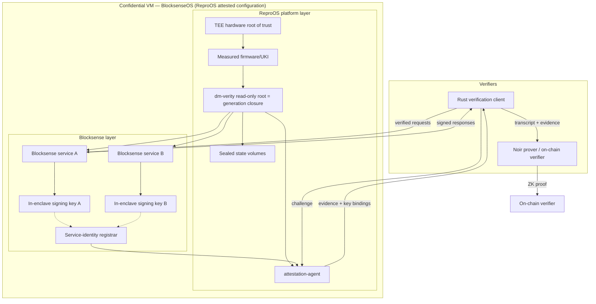

# BlocksenseOS Design Document

**Version:** 0.2.0
**Date:** 2026-07-08

> **Status:** Active redesign. BlocksenseOS is being re-founded as a
> downstream **attested configuration of ReproOS** — the
> general-purpose reproducible operating system with remote
> attestation of configurations developed by Metacraft Labs. The
> v0.1.0 design (a bespoke NixOS-based confidential-computing OS) is
> superseded; the migration of the existing prototype is planned in
> [ReproOS-Migration.milestones.org](./ReproOS-Migration.milestones.org).
>
> Platform references (the `metacraft-labs/reprobuild-specs` repo):
> - [ReproOS-Remote-Attestation.md](https://github.com/metacraft-labs/reprobuild-specs/blob/latest/ReproOS-Remote-Attestation.md)
>   — attested configurations: measurement chain, attestation agent,
>   verifier, secret provisioning, sealed storage.
> - [ReproOS.md](https://github.com/metacraft-labs/reprobuild-specs/blob/latest/ReproOS.md)
>   — full-source bootstrap and the build-time evidence model.
> - [ReproOS-Configuration-Architecture.md](https://github.com/metacraft-labs/reprobuild-specs/blob/latest/ReproOS-Configuration-Architecture.md)
>   — `system.nim` + activity-module configuration model.
> - [ReproOS-Image-Recipe.md](https://github.com/metacraft-labs/reprobuild-specs/blob/latest/ReproOS-Image-Recipe.md)
>   — deterministic whole-system image builds.

## 1. What BlocksenseOS Is

BlocksenseOS is the **Blocksense network's attested configuration of
ReproOS**: a curated system profile that runs Blocksense workloads
(oracle services, verifiable computation) inside hardware TEEs
(AMD SEV-SNP, Intel TDX) such that:

1. Anyone can verify — via remote attestation — that a BlocksenseOS
   instance is running exactly the published, reproducibly built
   software stack, from firmware-adjacent boot components down to
   every byte of the root filesystem.
2. Responses produced by services on such an instance can be proven
   authentic to third parties, including **on-chain**, via
   zero-knowledge proofs, without the verifying party interacting
   with the instance.

The first property is supplied wholesale by the ReproOS platform.
The second property is the Blocksense-specific layer this document
specifies.

### 1.1 Division of responsibilities

| Concern | Owner |
| --- | --- |
| Reproducible system builds, content-addressed store, generations | ReproOS / reprobuild |
| Attestable image profile (UKI + dm-verity root, separated encrypted state) | ReproOS ([Remote-Attestation §4.2](https://github.com/metacraft-labs/reprobuild-specs/blob/latest/ReproOS-Remote-Attestation.md)) |
| TEE backends (SEV-SNP, TDX), TPM tier, mock tier | ReproOS attestation agent |
| Launch-measurement precomputation (measurement manifests) | ReproOS image pipeline |
| Report schema, verifier CLI/library, measurement policies | ReproOS `repro attest` |
| Secret provisioning to attested instances (HPKE, ephemeral-key binding) | ReproOS ([Remote-Attestation §8](https://github.com/metacraft-labs/reprobuild-specs/blob/latest/ReproOS-Remote-Attestation.md)) |
| Sealed storage (LUKS bound to measured boot state) | ReproOS ([Remote-Attestation §9](https://github.com/metacraft-labs/reprobuild-specs/blob/latest/ReproOS-Remote-Attestation.md)) |
| The BlocksenseOS configuration (`system.nim`, activity modules, service set) | **This repo** |
| Service identity: in-enclave signing keys bound to attestation | **This repo** (§4) |
| Signed service responses and their transcript format | **This repo** (§4) |
| ZK (Noir) proof circuits + prover/verifier tooling | **This repo** (§5) |
| On-chain verification and Blocksense contract integration | **This repo / blocksense-network contracts** (§5.4) |
| Blocksense measurement policy + governance of approved measurements | **This repo** (§6) |

Design rule of thumb: anything a *different* confidential-computing
product would also need belongs upstream in ReproOS; anything that
encodes Blocksense semantics (which services, which keys, which
chains, which proofs) belongs here. When migration work discovers a
generalizable gap, it is contributed upstream rather than forked
locally (see the migration plan, M-track "upstream-first" rule).

## 2. Goals

- **Verifiability:** remote attestation of the entire stack —
  inherited from ReproOS; BlocksenseOS's job is to *pin and publish*
  its configuration and measurements, not to build the machinery.
- **Reproducibility:** bit-for-bit rebuildable images — inherited;
  BlocksenseOS CI runs the standard determinism gates on its own
  configuration.
- **Confidentiality:** TEE-protected execution for CPU (and later
  GPU) workloads — inherited, with Blocksense-specific GPU needs
  tracked as an upstream extension (§7).
- **Service authenticity:** any response from a BlocksenseOS service
  is attributable to (a) a specific service, in (b) a specific
  attested configuration, on (c) genuine TEE hardware — §4.
- **Zero-knowledge verifiability:** the above attribution can be
  proven in ZK for on-chain consumption — §5.
- **Operational sanity:** node operators deploy standard ReproOS
  images with a standard verifier surface; nothing bespoke to
  install or trust beyond the published configuration.

## 3. System Architecture


```mermaid
graph TD
    subgraph Verifiers
        RC[Rust verification client]
        NC[Noir prover / on-chain verifier]
    end

    subgraph "Confidential VM — BlocksenseOS (ReproOS attested configuration)"
        subgraph "ReproOS platform layer"
            HW[TEE hardware root of trust] --> FW[Measured firmware/UKI]
            FW --> VR[dm-verity read-only root = generation closure]
            VR --> AA[attestation-agent]
            VR --> SS[Sealed state volumes]
        end
        subgraph "Blocksense layer"
            VR --> SVC1[Blocksense service A]
            VR --> SVC2[Blocksense service B]
            SVC1 --> SK1[In-enclave signing key A]
            SVC2 --> SK2[In-enclave signing key B]
            REG[Service-identity registrar] --> AA
            SK1 -.-> REG
            SK2 -.-> REG
        end
    end

    RC -- challenge --> AA
    AA -- evidence + key bindings --> RC
    RC -- verified requests --> SVC1
    SVC1 -- signed responses --> RC
    RC -- transcript + evidence --> NC
    NC -- ZK proof --> Chain[On-chain verifier]
```

Boot and attestation identity follow ReproOS exactly: the
configuration's identity rides in the **launch measurement** (the
UKI measurement transitively pins the verity-protected root
filesystem, i.e. the entire generation closure). Note the contrast
with the v0.1.0 design, which planned to bake an OS-image hash into
the initrd and carry identity in `REPORT_DATA`: under the ReproOS
model `REPORT_DATA` carries only freshness and key bindings, and
configuration identity is measured by the hardware at launch —
strictly stronger, and no longer this repo's code to maintain.

### 3.1 The BlocksenseOS configuration

BlocksenseOS is defined as a ReproOS system profile
([ReproOS-Configuration-Architecture.md](https://github.com/metacraft-labs/reprobuild-specs/blob/latest/ReproOS-Configuration-Architecture.md)):

```nim
# blocksense-os/system.nim (illustrative shape)
import repro_profile

system "blocksense-node":
  imports:
    "./hardware.nim"
    "modules/attestation.nim"        # ReproOS activity, tier = cvm
    "modules/blocksense/services.nim"  # Blocksense service activity
    "modules/blocksense/identity.nim"  # service-identity registrar

  config:
    ## TEE tier for this deployment profile. cvm for production;
    ## the tpm/mock tiers exist for operator rehearsal and CI.
    ## @variant
    attestationTier: AttestationTier = atCvm

  validate:
    attestationTier == atCvm or not isProductionProfile()
```

The image is built with the standard ReproOS image recipe using the
`uefi-attested` layout; the build emits the **measurement manifest**
(expected SEV-SNP launch digests, TDX MRTD/RTMRs, TPM PCRs) as an
ordinary artifact. Blocksense publishes these manifests, signed,
alongside each release (§6).

Reference services: the repository keeps the C++ and Rust echo
services as minimal end-to-end exemplars of "a service whose
responses are attributable to an attested configuration". Real
Blocksense workloads (oracle feeds, data-processing services) plug
into the same activity module shape.

## 4. Service Identity and Signed Responses

The launch measurement pins *code*. Blocksense additionally needs
per-service *keys* so that individual responses are attributable
without a fresh attestation round-trip per request.

1. **Key generation.** At service start, each Blocksense service
   generates a signing key pair in memory (secp256k1 for
   chain-compatible verification; the curve is a per-service
   choice recorded in the identity record). Keys never touch
   persistent storage; a reboot (new measured boot session) means
   new keys.
2. **Binding keys to the attested instance.** The service-identity
   registrar aggregates the running services' public keys into a
   canonical **service-identity record**:
   `{generation, service_name, package_store_hash, pubkey, curve}`
   entries, Merkle-ized so that verifiers can request proofs for a
   single service without downloading the whole record. The Merkle
   root is bound to the instance by requesting an attestation whose
   `report_data` binding covers the root (the standard ReproOS
   64-byte binding discipline: the root rides in the
   challenge-bound hash, not as a substitute for the launch
   measurement).
3. **Signed responses.** Services sign
   `SHA-256(domain_tag ‖ request_hash ‖ response_hash ‖ counter)`
   over every response. A verifier who has (a) verified the
   instance's attestation, (b) verified the Merkle proof binding
   the service's pubkey to that attestation, and (c) verified the
   response signature, has an offline-checkable transcript:
   *this response came from this service inside this attested
   configuration*.
4. **Verification client.** The Rust client drives the full chain:
   challenge → `repro attest`-based evidence verification against
   the published Blocksense measurement policy → key-binding proof
   → request/response with signature check. It is a thin
   composition of the ReproOS verifier library plus the
   Blocksense transcript rules — by design, so audits concentrate
   on the small Blocksense-specific surface.

The v0.1.0 `derivation-hasher` (a sparse Merkle tree over Nix
derivation hashes, folded into `REPORT_DATA`) is retired by this
design: closure identity is already covered by the verity-pinned
launch measurement, and per-service selective disclosure is
provided by the ReproOS measurement manifest plus the
service-identity record above. What survives of it is the SMT
implementation experience, which the identity registrar reuses
(migration M4).

## 5. Zero-Knowledge Verification (Noir Client)

Goal: Alice proves to Bob — or to a smart contract — that a
specific response was produced by an authenticated service running
in a verified BlocksenseOS instance, without revealing unnecessary
transcript detail and without Bob talking to the instance.

### 5.1 Statement

Public inputs: expected measurement (or a commitment to the
approved-measurement set), service identifier, commitment to the
request/response, TEE-vendor root-key commitment.

Private inputs: the attestation evidence, the service-identity
Merkle proof, the signed response, blinding material.

The circuit proves:

1. The evidence is a valid vendor-signed report whose measurement
   is in the approved set (§5.3 for how much of this is in-circuit).
2. The service-identity root is bound to that evidence via the
   report-data binding, and the service's pubkey is in the root
   (Merkle proof).
3. The response signature verifies under that pubkey over the
   committed request/response.

### 5.2 Circuit composition

- Hashing (SHA-256/512, Keccak) and secp256k1 ECDSA verification
  from the Noir standard library / vetted community libraries
  (audit status tracked per dependency).
- Merkle-proof verification: straightforward in-circuit.
- The expensive part is vendor-signature verification (ECDSA P-384
  for SEV-SNP VCEK chains, P-256 for TDX quotes) — §5.3.

### 5.3 Layered verification (pragmatic path)

Full vendor-chain verification in-circuit is costly, so the design
admits three deployment stages:

1. **Committee-verified evidence (v1).** A quorum of watchers each
   run the standard `repro attest` verification off-circuit and
   sign the resulting `(measurement, service_root, epoch)` fact;
   the circuit verifies the quorum signatures (cheap) plus items
   2–3 in full. Trust: K-of-N watchers, same shape as other
   Blocksense quorum assumptions.
2. **In-circuit quote verification (v2).** Replace the watcher
   quorum with in-circuit P-256 verification for TDX quotes first
   (cheaper curve), SNP later.
3. **Recursive/ZKVM offload (v3).** Wrap the vendor-chain check in
   a succinct proof produced by a general-purpose prover and
   verify recursively — aligning with the ZK-attestation extension
   ReproOS itself anticipates for its evidence model.

### 5.4 On-chain integration

The Noir verifier is deployed as a contract (Solidity wrapper over
the proof-system verifier); the approved-measurement set is managed
by the same governance that manages Blocksense contracts (§6).
Gas cost scales with the stage chosen in §5.3 — the v1 committee
shape is deliberately the cheapest.

## 6. Measurement Governance

- Every BlocksenseOS release publishes: the configuration source
  (tagged), the image + measurement manifest, and the build-graph
  evidence (rebuilder signatures / transparency-log inclusion per
  the ReproOS evidence model).
- The **Blocksense measurement policy** (a standard
  `reproos.attestation-policy.v1` document) pins the approved
  manifests, minimum TCB levels, and tier (`cvm` only in
  production). Verifiers — the Rust client, the watcher committee,
  the on-chain approved-set — consume the same policy content.
- Measurement upgrades (new release) and revocations (pulled
  release, TCB recovery events) are explicit governance actions
  with on-chain visibility for the contract-facing set. Silent
  measurement changes are rejected by every verifier by
  construction.

## 7. Hardware and Deployment

Deployment targets, TEE generational concerns, cloud CVM support,
vTPM trust rules, and the QEMU/KVM + swtpm development harness are
platform concerns — see
[ReproOS-Remote-Attestation.md §3, §9, §10](https://github.com/metacraft-labs/reprobuild-specs/blob/latest/ReproOS-Remote-Attestation.md).
BlocksenseOS-specific notes:

- **Production tier:** CVM only (SEV-SNP or TDX). The TPM tier is
  permitted for operator rehearsal environments and is refused by
  the production measurement policy.
- **Node operators** receive: the image, the manifest, a
  ready-made policy file, and the verifier CLI. "Trust me, it's
  the right VM" is never part of the operator relationship.
- **Confidential GPU workloads** (NVIDIA Hopper-class, for
  compute-heavy oracle/AI tasks) depend on the ReproOS GPU
  attestation extension; Blocksense tracks it upstream and adds
  only workload integration here.

## 8. Security Considerations

Platform-level analysis (measurement chain, sealed storage, TEE
side channels, TCB recovery, agent hardening, fail-closed verifier
semantics) lives in
[ReproOS-Remote-Attestation.md §11–12](https://github.com/metacraft-labs/reprobuild-specs/blob/latest/ReproOS-Remote-Attestation.md).
The Blocksense-specific residue — service-key lifecycle, transcript
replay rules, watcher-committee compromise, circuit soundness,
on-chain approved-set governance — is analyzed in
[THREAT-MODEL.md](./THREAT-MODEL.md).

## 9. Migration From the v0.1.0 Prototype

The current repository contents (NixOS flake, mock-TEE attestation
agent, derivation-hasher, echo services, Rust client, CI harness)
are the v0.1.0 prototype. The component-by-component disposition —
what ports, what migrates upstream, what is retired — and the
ordered plan with verification gates is in
[ReproOS-Migration.milestones.org](./ReproOS-Migration.milestones.org).
Until that plan completes, the NixOS-based prototype remains
buildable for development continuity, but no new platform-level
capability (TEE backends, image measurement, sealing) is developed
in this repo — that work happens upstream in ReproOS.
